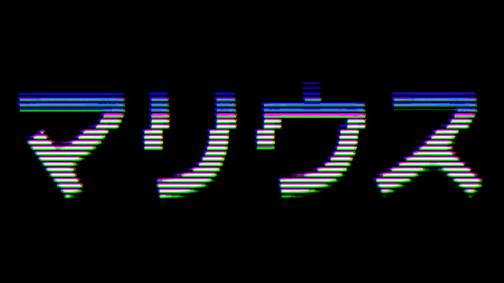

## OPEN SOURCE PROJECTS

- Kiwi: Turn your Pimoroni Keybow into a fully customizable, wireless 
  Elgato Stream Deck! 
  https://github.com/mrusme/kiwi
- Journalist: An RSS aggregator a.k.a. "self-hosted Feedly"
  https://github.com/mrusme/journalist
- Canard: A TUI client for the Journalist RSS aggregator
  https://github.com/mrusme/canard
- Zeit: A CLI time-tracking tool compatible with the macOS/iOS Tyme format
  https://github.com/mrusme/zeit
- Geld: A CLI budget-tracking tool, compatible with your bank's CSV exports
  https://github.com/mrusme/geld
- Conclusive: A CLI client for Plausible Analytics with nice ASCII graphs
  https://github.com/mrusme/conclusive
- Gomphotherium: A TUI client for the Fediverse / Mastodon / Pleroma
  https://github.com/mrusme/gomphotherium
- More
  https://github.com/mrusme?tab=repositories

## JOURNAL

Read it at https://xn--gckvb8fzb.com 
(that's punycode for https://マリウス.com) 

## LET'S TEAM UP

Want to work on cool things, whether it's open source projects, an idea for a 
startup or commercial projects? Reach out!

marius@xn--gckvb8fzb.com (4D38 99AF 73E7 F5FE 9B39 C822 272E D814 BF63 261F)

